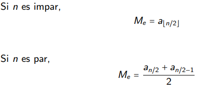

# Clase 4: Quick sort
## Búsqueda binaria
Basado en dividir para conquistar. Se sustenta en usar un **pivote**. Este es un número que nos servirá para trabajar con índices que luego nos ayudará a subdividir el problema original.

## Particiones

Ahora usando un pivote, número x de la lista, moveremos a un lado u otro todos los elementos de la listad ependiendo si son menores o mayores que el pivote, izquierda a derecha respectivamente.

Con esto pivote queda en el lugar donde le corresponde, teniendo ya este elemento ordenado.

### Complejidad
Solamente le cuesta leer los n elementos entonces es O(n).

Esto lo llamaremos partition.

## Quicksort
Ahora con la idea de partition, podemos ordenar llamando varias veces a partition.

Entonces con un array de largo n, donde tendremos indices i y f, representando inicio y fin, podemos llamar a partition solo si i <= f. Osea que tienen un tamaño correspondiente.

Luego con el pivote de partition, llamará a quicksort nuevamente con la separación del pivote. Ahora tendriamos un quicksort con el mismo array, tomando desde i hasta el pivote -1 y la otra parte sería desde p+1 hasta f.

Sabemos que el algoritmo es correcto ya que vemos que partition termina. Siempre escogerá un pivote y tiene casos finitos.

Luego al usar quicksort, usaremos partition con 1 elemento menos, que sería el pivote y así será hasta que se haya ordenado todos los elementos.

## Complejidad
Esta depende de la suerte que tengamos al escoger aleatoriamente el pivote.

- Mejor caso: Partition genera sub secuencias del mismo tamaño (mediana). Su complejidad sería por la llamada recursiva log 2 (n) y por partition. Osea O(n log n)

- Peor caso: Se escoge un elemento extremo, siendo el menor o mayor del arreglo. Con esto entonces pasaria que no habria subdiviciones. O(n²)

- Caso promedio: Este cálculo se vuelve un poco más pesado, terminando en que el promedio es =(n log n)

