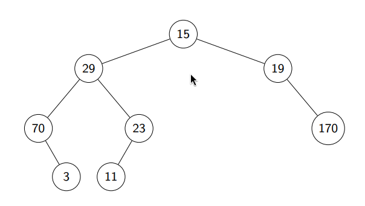
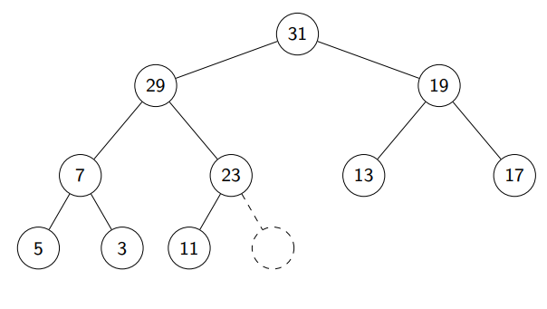

# Clase 6: Heap sort

Debemos recordar las estructuras de FIFO y LIFO. Estas son estructuras que funcionan a partir de la prioridad que tengan siendo quién llega antes o quién llego después respectivamente.

## Cola de prioridades
Esta en cambio permite insertar un dato con alta prioridad, extraer uno con alta prioridad y cambiar prioridades. El orden de llegada no equivale a su importancia.

### Heaps
A diferencia de lo que hemos visto, una cola necesita un orden pero basta con que sea parcial no uno total. Su formato se definirá como sub-sectores de un arreglo A tal que ellos estén con un orden.

## Árbol binario (AB)
Estructura que almacena llaves que se asocian con punteros. Los nodos tienen las llaves y pueden tener hasta 2 hijos (esto asume que la mayoria tiene un padre).

## Max heap binario
Un árbol que tiene 2 hijos tal que su padre tiene una llave estrictamente mayor que la de ellos, en cambio entre sus hijos no hay restricciones. Los hijos de la raíz también son max heap binario por lo que es recursivo.

Funcionan con niveles o capas. Los niveles no deben estar necesariamente llenos, pero al añadir un nuevo nodo debe ir en la capa que esta quedando vacía hasta que se complete, sino no se podrá añadir más niveles. Esto tampoco garantiza que los nodos siempre deban tener una cantidad fija de hijos, la raíz podría no tener hijo derecho por ejemplo. 

Idealmente se haran tal como árboles casi llenos.

Cabe decir que los nodos de 1 mismo nivel no tienen relevancia entre sus nodos de capa.

La prioridad que se establece se refiere al valor del nodo, siendo la raíz 31 la más prioritaria, luego la 29 y asi...

Normalmente lo representaremos como array cuando se trata de código ya que es más sencillo:

| Valor | 31 | 29 | 19 | 7 | 23 | 13 | 17 | 5 | 3 | 11 | Vacío|
| :---: | :---: | :---: | :---: | :---: | :---: | :---: | :---: | :---: | :---: | :---: | :---: |
| **Índice** | 0 | 1 | 2 | 3 | 4 | 5 | 6 | 7 | 8 | 9 | 10 |

## Operar en max heap
Como el primer elemento será el más prioritatio y necesitamos sacarlo, nuestro árbol no estará casi lleno, falta una nueva raíz. Para solucionarlo moveremos temporalmente el último elemento real del arreglo y compararemos recursivamente hasta encontrar el elemento con mayor valor.

Si seguimos con la lógica sería llevar a 11 como raíz, luego cambia puesto con 29, después con 23 y habría terminado.

Esto sería O(log n) por estar casi lleno.

La inserción de un nodo nuevo funciona igual que el anterior. Se coloca el nodo al final y se va comparando recursivamente hasta que encuentre su posición correspondiente. También O(log n)

## Heapsort
Si tenemos un array desordenado y queremos construirlo como un heap tenemos 2 formas:
1. Sift up: Consiste en llamar repetidamente la función de inserción n veces, osea O(n log n).
2. Sift down (la recomendada): Considerar incialmente el array ya como el árbol a pesar de que viole el principio de padre-hijo. Desde la mitad del array en adelante, los heaps ya son válidos por ser hojas.
Ahora usaremos piso(n/2) - 1, hasta la izquierda, ellos serán los elementos que manipularemos e iremos comparando con sus hijos si deben cambiarse con siftdown. Este es O(n)

Si usamos el segundo método, veremos que en la raíz siempre tendremos al elemento maś grande, con ello podemos ordenar el grafo y dejar siempre a la raíz como último elemento e ir avanzando hasta tener el array ordenado.

La idea es subir siempre el elemento mayor al tope del array e ir eliminando después la raíz, que seria añadir el elemento al final.

Esta estrategia tiene 2 partes:
1. Construir el heap. O(n).
2. Ordenar recorriendo los niveles, siendo log n, pero esto lo hacemos n-1 veces entnces O(n log n).

Finalmente su costo en cualquier ocasión es O(n log n).