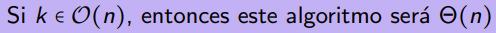
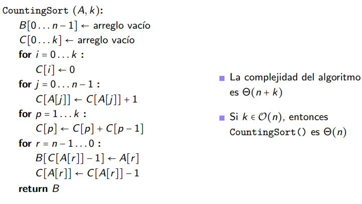
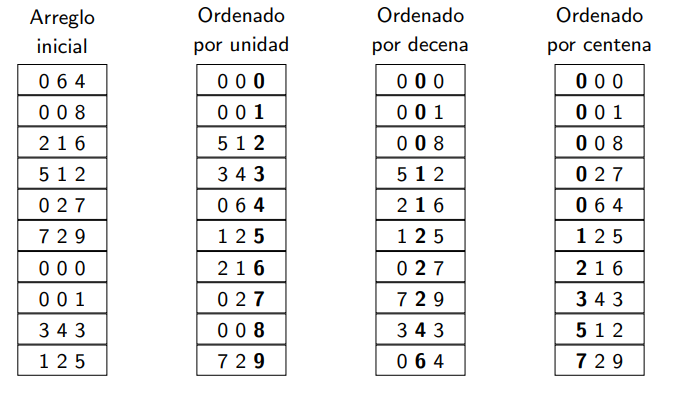

# Clase 7: Ordenación lineal

Consideremos una secuencia de  n elementos naturales entre 0 y k. Los valores pueden repetirse en ella.

Ahora para ordenarlos podemos contarlos en vez de ordenar cada elemento. No compararemos directamenet sino que contaremos cuantos datos son menores que el y asi saber la posición de cada uno.

Entonces su tiempo es estrictamente lineal:

## Counting sort
Este toma el array original con los elementos y un valor k, que representa el número máximo que hay en el array A.

Luego crea 2 arreglos más: B que tendrá n celdas y C que tendrá k+1 celdas, representando los posibles valores que tendrán los elementos del array original A.

1. Añadiremos en C todos los números posibles del 0 hasta k.
2. Recorremos los elementos de A, encontramos el valor que hay y lo buscamos en C y sumamos 1 en el mismo contador de C.
3. Se crea una escalera numérica para mantener un orden con frecuencias acumuladas.
4. Agrega los datos en B tal que recorre inversamente C y los va colocando según orden de aparición. Cada que sale uno resta el contador de aparición del elemento.

---

Este algoritmo depende del tamaño de n y de k. Si k crece a la misma velocidad que n entonces el algoritmo es theta de n.

## Radix sort
De ordenamiento lineal.

Este ordena los elementos según su dígito menos significativo hasta el más significativo.

Este algoritmo es estable por su respeto que tiene ante evaluaciones previas. Aunque siga trabajando, considera las operaciones anteriores, como el orden de dígito o decena.

Como usa counting sort de base, su complejidad irá similar:  Θ(d ⋅ (n + k)); d es la cantidad de dígitos, n la cantidad de elementos y k el rango numérico de la base.

### Usos de radix
- LSD string sort: Ordena strings del mismo largo y funciona bien si el largo es pequeño. No es recursivo.
- MSD string sort: Largos diferentes. Se usa counting sort para el primer elemento, osea el más significativo. Esta trabaja recursivamente. Se detiene si un grupo tiene solo 1 elemento o si se acabaron los dígitos. Para declarar que a 1 palabra se le acabó los dígitos se le suele colocar un -1 para declarar su fin.