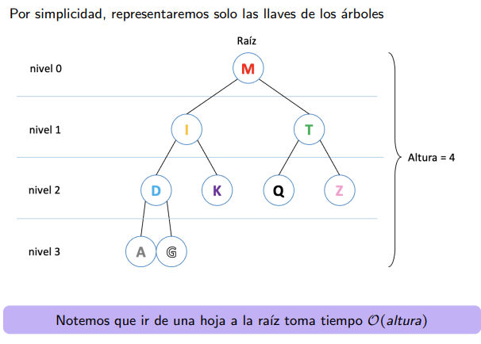

# Clase 8: Árboles binarios de búsqueda

Se definirá una nueva estructura que tendra llaves que serán valores. La razón es buscar rápidamente si esta o no, agregar y eliminar pares, y todo esto de manera eficiente.

Usaremos la idea de diccionario, estructura que asocia un valor a una clave, como rut por llave y nombre como valor.

Para este trabajo usaremos listas ligadas en vez de listas ya que en ciertos escenarios son más baratas como la inserción de un nuevo elemento siendo O(1) y necesita pocos punteros, mientras que en un arreglo puede desplazar los datos y gatillar por la memoria, junto que su inserción es O(n).

## ABB
Nuestra estructura tendrá una forma que almacena pares de llave y valor. Usará nodos y se asociará con punteros de hijos izquierdo/derecho.

Su estrategia es tener una raíz que sea la mitad de los valores aproximadamente y que todo elemento a la izquierda del padre sea menor mientras que al otro lado, la derecha, serán mayores. Este comportamiento se replicará en cada nodo y aplicará a su vez a sus hijos, siendo asi recursivo.

Como vemos, funciona con niveles donde se ve su uso.

## Estructura
- x.key la llave.
- x.value su valor (no se suele usar).
- x.left.
- x.right.
- x.p (padre).

## Práctica
Veremos como funciona:
1. Buscar 1 dato: Comparamos si la raiz es el valor, si es menor/mayor ir a uno de sus respectivos hijos. Con esto comparamos la key hasta encontrar el elemento y redirigiendonos según las condicionales. Rapidamenet veremos si esta o no.

2. Insertar: Basta con buscar al padre que debe conectarlo. Al encontrarlo le asocia uno de sus espacios vacíos y lo heredera como hijo.

3. Eliminación: Si el nodo es una hoja se borra. Si tenía hijo, el hijo lo reemplaza pero si tenia 2 hijos se complica. Podemos usar 1 de 2 estrategias para eliminarlo que se basan en reemplazar el valor: 1) Encontrar el mayor elemento de los menores elementos o encontrar el menor elemento de los mayores, esto situandonos desde el nodo que queremos eliminar. 

Hay que tener en cuenta que la eliminación es la más dificil, incluso se debe resolver ciertos casos recursivamente o que se deba evaluar diversas situaciones.

(Además si vemos, encontrar el valor mín y máx resulta ser bastante fácil)

## Complejidad
En un caso pomedio, su precio es O(log n). Mientras que su peor caso es que se vuelva como una lista, osea que todo este a la derecha o izquierda, volviendolo O(n). Esto sucede ya que la idea es descartar mitades y no recorrerlas puramente si no es necesario.

